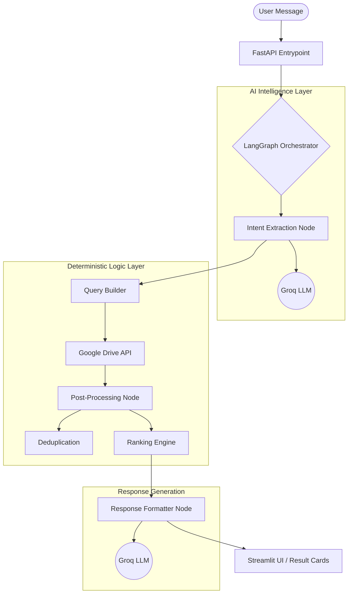

# 📁 Tailortalk

### *Next-Generation Conversational Intelligence for Google Drive Retrieval*

[](https://www.python.org/downloads/)
[](https://fastapi.tiangolo.com/)
[](https://streamlit.io/)
[](https://github.com/langchain-ai/langgraph)
[](https://opensource.org/licenses/MIT)

Tailortalk is a production-grade AI-powered assistant designed to bridge the gap between human language and structured cloud storage. By leveraging **LangGraph** for deterministic orchestration and **Groq** for high-speed LLM inference, Tailortalk transforms Google Drive from a static file repository into a conversational discovery engine.

---

## 🚀 Project Overview

### The Problem
Traditional file search relies on exact keyword matching and rigid folder hierarchies. Users often struggle to find documents unless they remember the precise filename or location, leading to significant productivity loss in large-scale corporate environments.

### The Solution
Tailortalk introduces **Conversational Retrieval**. It allows users to query their Google Drive using natural, ambiguous language. The system extracts intent, maintains conversational memory, and executes deterministic search queries, providing a human-centric layer over the Google Drive API.

---

## ✨ Key Features

- **🔍 Semantic Intent Extraction**: Precisely identifies filters (MIME types, dates, owners, folders) from natural language using Pydantic v2 validation.
- **🧠 Conversational Memory**: State-aware architecture that allows for iterative refinement (e.g., *"Show my PDFs"* followed by *"Only the ones from last week"*).
- **📊 Intelligent Ranking Engine**: A 100-point scoring algorithm that ranks results based on name similarity, recency, and ownership.
- **🔁 Deduplication & Grouping**: Advanced post-processing pipeline that collapses exact duplicates and groups visually similar results.
- **❓ Proactive Clarification**: Gracefully handles vague or broad queries by requesting specific missing parameters.
- **🔒 Deterministic Query Building**: Unlike "Black Box" AI, Tailortalk uses a deterministic builder—ensuring the LLM never generates raw API queries directly.

---

## 🏗️ System Architecture

Tailortalk follows a decoupled architecture, separating the LLM-powered intelligence layer from the deterministic business logic.

### Request Lifecycle & Orchestration
The core logic is orchestrated via a **LangGraph State Machine**, ensuring a predictable and traceable execution path:



---

## 🛠️ Tech Stack

| Component | Technology | Role |
| :--- | :--- | :--- |
| **Backend** | FastAPI | High-performance asynchronous API |
| **Orchestration** | LangGraph | State-managed agentic workflow |
| **LLM Inference** | Groq (Llama 3) | High-speed structured extraction |
| **Validation** | Pydantic v2 | Type safety and data integrity |
| **Frontend** | Streamlit | Modern, interactive user interface |
| **Cloud API** | Google Drive v3 | Metadata and file discovery |
| **Environment** | Python 3.10+ | Core language runtime |

---

## 📂 Folder Structure

```text
Tailortalk/
├── backend/
│   ├── agent/                 # LangGraph workflow, nodes, and state schemas
│   ├── api/                   # FastAPI routing and lifecycle events
│   ├── schemas/               # Structured Pydantic v2 models (Intent, Drive, Session)
│   ├── services/              # Business logic (Query Builder, Ranker, Dedup Engine)
│   ├── session/               # State management (Follow-up merging logic)
│   └── utils/                 # MIME mapping, logging, and date helpers
├── frontend/
│   ├── components/            # Modular UI (Chat Interface, Result Cards)
│   ├── state/                 # Streamlit session state orchestration
│   ├── utils/                 # API communication and visual icons
│   └── app.py                 # Streamlit application entrypoint
├── tests/                     # Unit and integration test suite
├── .env                       # Environment configuration
├── start.py                   # Unified system launcher
└── requirements.txt           # Dependency management
```

---

## 🚀 Installation & Setup

### 1. Repository Setup
```bash
git clone https://github.com/Solanki777/EasyFetch.git
cd Tailortalk
```

### 2. Virtual Environment
```bash
python -m venv venv
source venv/bin/activate  # Windows: .\venv\Scripts\activate
pip install -r requirements.txt
```

### 3. Google Drive Authentication
Tailortalk uses **Application Default Credentials (ADC)**. Run the following command and follow the browser prompts:
```bash
gcloud auth application-default login
```
*Ensure the Drive API is enabled in your Google Cloud Project console.*

### 4. Configuration
The system requires a `.env` file in the root directory to store sensitive API keys.

1.  **Create the file:**
    ```bash
    touch .env  # Or create a new file named .env in the root folder
    ```
2.  **Add your Groq API Key:**
    Visit [Groq Cloud Console](https://console.groq.com/keys) to generate a key.
    ```env
    GROQ_API_KEY=gsk_your_actual_key_here
    LLM_MODEL=llama3-8b-8192
    BACKEND_URL=http://localhost:8000
    ```

> [!IMPORTANT]
> **Tailortalk will not start without a valid `GROQ_API_KEY`.** This key powers the intent extraction and response formatting layers.

### 5. Launch the System
Tailortalk includes a unified startup script to launch both services:
```bash
python start.py both
```

---

## 📡 API Reference

| Endpoint | Method | Description |
| :--- | :--- | :--- |
| `/api/v1/chat` | `POST` | Primary conversational search endpoint |
| `/api/v1/session/{id}` | `GET` | Retrieve session history and active filters |
| `/health` | `GET` | System health and version status |
| `/docs` | `GET` | Interactive Swagger/OpenAPI documentation |

---

## 💬 Example Queries

- **Discovery**: *"Find my project proposals from this year."*
- **Filtering**: *"Show only PDFs."*
- **Follow-up**: *"Now only the ones shared by Mahesh."*
- **Navigation**: *"Open the second result."*
- **Broad Search**: *"List all files in the 'Finance' folder."*

---


## 📸 Screenshots

### 🔍 Find All Files
The assistant retrieves and ranks all accessible Google Drive files conversationally.


---

### 🎯 Search Specific Files
Users can search for specific files using natural language queries.


---

### 📄 Filter PDF Files
The assistant intelligently filters and returns only PDF documents.


---

### 🖼️ Filter Image Files
Supports image-based filtering for PNG, JPG, and other image formats.


---

### 📂 Browse Folders
Retrieve only Google Drive folders conversationally.


---

### 📊 Spreadsheet Discovery
Find spreadsheets and tabular documents using natural language queries.


---

### 🕒 Recent Upload Discovery
Search files dynamically based on upload and modification recency.


## 🛡️ Production Engineering Highlights

### Deterministic Orchestration
Unlike traditional agents that "loop" indefinitely, Tailortalk uses a **Directed Acyclic Graph (DAG)**. This ensures that every request follows a validated, predictable path from intent to result, critical for enterprise reliability.

### Separation of Intelligence and Execution
We treat the LLM as a **Translation Layer**, not an Execution Layer. The LLM translates natural language into a validated `SearchIntent` object. All interactions with the Google Drive API are then handled by deterministic Python code.

### Typed Data Integrity
The entire pipeline is built on **Pydantic v2**. This ensures that every piece of data—from the user's intent to the Drive file metadata—is validated against strict schemas before being processed.

---

## 🔧 Troubleshooting

| Issue | Potential Cause | Solution |
| :--- | :--- | :--- |
| `ModuleNotFoundError` | Path resolution error | Run with `python start.py` or set `PYTHONPATH=.` |
| `401 Unauthorized` | Invalid Google Credentials | Re-run `gcloud auth application-default login` |
| `Groq API Error` | Missing/Expired API Key | Check `.env` for `GROQ_API_KEY` |
| `Backend Unreachable` | Backend process not running | Ensure `python start.py backend` is active |

---

## 🗺️ Future Roadmap

- [ ] **Vector Search (RAG)**: Implement semantic search within document content using embeddings.
- [ ] **OCR Integration**: Enable searching inside images and scanned PDFs.
- [ ] **Redis Backend**: Persistent, scalable session management for production clusters.
- [ ] **Streaming Responses**: Token-by-token conversational UI for lower perceived latency.
- [ ] **Multi-Cloud Support**: Expand discovery to OneDrive and Dropbox.

---

## 📄 License

Distributed under the MIT License. See `LICENSE` for more information.
